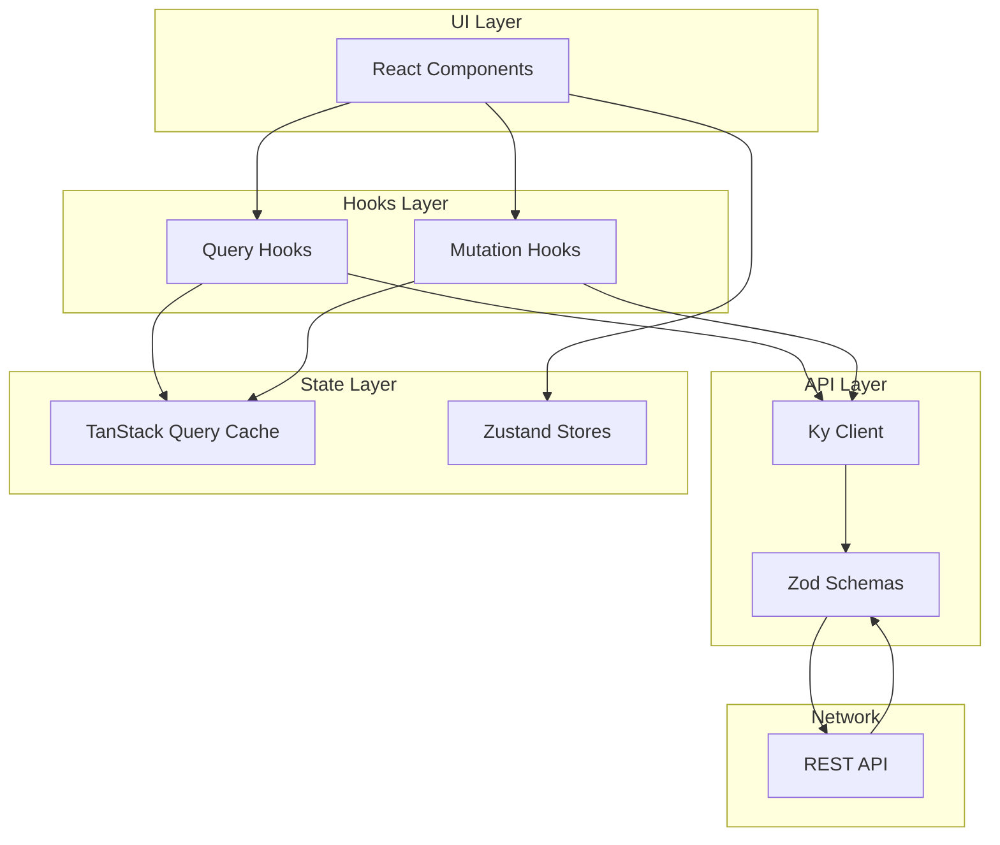
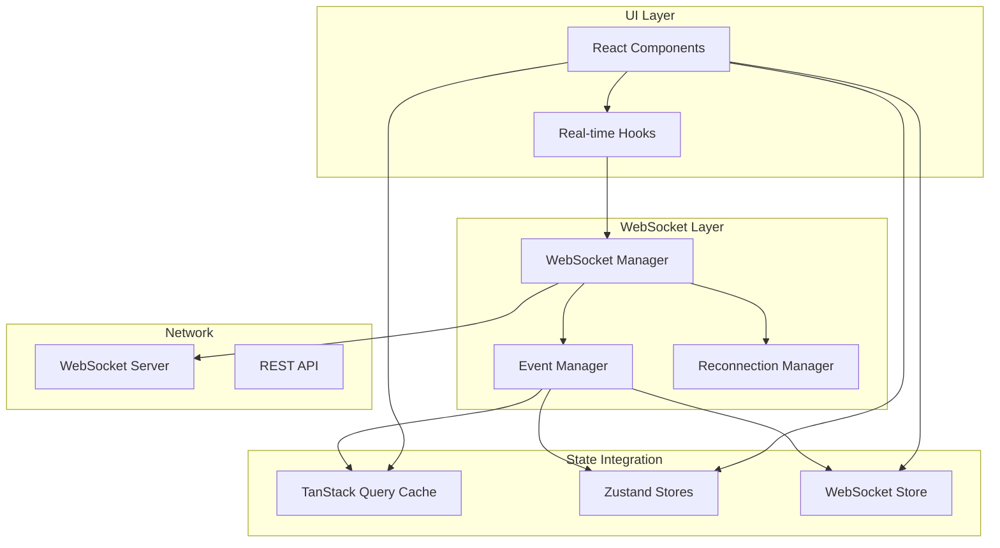

# API Architecture

## documentation

./api.md

## Overview

The API layer is built with a modern, type-safe architecture using **TanStack Query**, **Ky**, and **Zod**. This combination provides excellent developer experience, runtime safety, and optimal performance.

## Technology Stack

### Core Technologies

| Technology            | Purpose                 | Bundle Size | Why Chosen                                                 |
| --------------------- | ----------------------- | ----------- | ---------------------------------------------------------- |
| **TanStack Query v5** | Server state management | ~25KB       | Powerful caching, automatic refetching, optimistic updates |
| **Ky**                | HTTP client             | 4KB         | Modern, lightweight, built on Fetch API                    |
| **Zod**               | Runtime validation      | ~12KB       | Type inference, runtime safety, schema validation          |
| **Zustand**           | Client state            | 4KB         | Simple, performant, TypeScript-first                       |

### Technology Evaluation

#### TanStack Query ✅

- **Pros**: Intelligent caching, request deduplication, optimistic updates, SSR support
- **Cons**: Learning curve for advanced features
- **Verdict**: Industry standard for React server state

#### Ky ✅

- **Pros**: Lightweight (4KB vs Axios 27KB), modern Fetch API, clean interceptors
- **Cons**: Less ecosystem than Axios
- **Verdict**: Perfect for modern applications

#### Zod ✅

- **Pros**: TypeScript type inference, runtime validation, composable schemas
- **Cons**: Slight runtime overhead
- **Verdict**: Essential for API safety

#### Zustand ⚠️

- **Pros**: Simple API, TypeScript support, devtools, persistence
- **Cons**: May overlap with TanStack Query
- **Verdict**: Use only for complex client state

## Architecture Diagram



## Directory Structure

```
src/
├── api/
│   ├── client/
│   │   └── ky-client.ts         # HTTP client configuration
│   ├── endpoints/
│   │   ├── tokens/
│   │   │   ├── queries.ts       # GET requests
│   │   │   ├── mutations.ts     # POST/PUT/DELETE
│   │   │   └── index.ts         # Exports
│   │   ├── auth/
│   │   │   ├── queries.ts
│   │   │   └── mutations.ts
│   │   └── user/
│   │       ├── queries.ts
│   │       └── mutations.ts
│   ├── schemas/
│   │   ├── token.schema.ts      # Token validation
│   │   ├── auth.schema.ts       # Auth validation
│   │   └── user.schema.ts       # User validation
│   └── hooks/
│       └── useApiError.ts        # Error handling
├── stores/
│   ├── useAuthStore.ts          # Authentication state
│   ├── useUIStore.ts            # UI state
│   └── usePreferencesStore.ts   # User preferences
```

## Core Components

### 1. Ky Client Configuration

The HTTP client is configured with automatic retry, authentication, and error handling:

```typescript
// src/api/client/ky-client.ts
export const kyClient = ky.create({
  prefixUrl: API_BASE_URL,
  timeout: 30000,
  retry: {
    limit: 2,
    methods: ['get', 'put', 'delete'],
    statusCodes: [408, 413, 429, 500, 502, 503, 504],
  },
  hooks: {
    beforeRequest: [
      /* auth token */
    ],
    afterResponse: [
      /* error handling */
    ],
  },
})
```

### 2. Type-Safe Schemas

Zod schemas provide runtime validation and TypeScript types:

```typescript
// src/api/schemas/token.schema.ts
export const TokenSchema = z.object({
  id: z.string().uuid(),
  name: z.string().min(1).max(50),
  symbol: z.string().toUpperCase(),
  price: z.number().nonnegative(),
  // ...
})

export type Token = z.infer<typeof TokenSchema>
```

### 3. Query Hooks

TanStack Query hooks for data fetching:

```typescript
// src/api/endpoints/tokens/queries.ts
export const useTokens = (params?: TokenListQuery) => {
  return useQuery({
    queryKey: tokenKeys.list(params),
    queryFn: async () => {
      const response = await kyClient
        .get('tokens', {
          searchParams: params,
        })
        .json()
      return TokenSchema.array().parse(response)
    },
    staleTime: 1000 * 60 * 5, // 5 minutes
  })
}
```

### 4. Mutation Hooks

Mutations for data modification:

```typescript
// src/api/endpoints/tokens/mutations.ts
export const useCreateToken = () => {
  const queryClient = useQueryClient()

  return useMutation({
    mutationFn: async (data: CreateTokenInput) => {
      const validated = CreateTokenInputSchema.parse(data)
      const response = await kyClient
        .post('tokens', {
          json: validated,
        })
        .json()
      return TokenSchema.parse(response)
    },
    onSuccess: () => {
      queryClient.invalidateQueries({ queryKey: tokenKeys.lists() })
    },
  })
}
```

### 5. State Management

Zustand for client-side state:

```typescript
// src/stores/useAuthStore.ts
export const useAuthStore = create<AuthState>()(
  persist(
    (set) => ({
      user: null,
      accessToken: null,
      login: (user, tokens) => set({ user, accessToken: tokens.access }),
      logout: () => set({ user: null, accessToken: null }),
    }),
    { name: 'auth-storage' }
  )
)
```

## Data Flow

### Query Flow

1. Component calls `useTokens()` hook
2. TanStack Query checks cache
3. If stale/missing, calls query function
4. Ky client makes HTTP request
5. Response validated with Zod schema
6. Data stored in cache
7. Component receives typed data

### Mutation Flow

1. Component calls `useCreateToken()` hook
2. User triggers mutation
3. Data validated with Zod
4. Ky client makes POST request
5. On success, cache invalidated
6. Related queries refetch
7. UI updates automatically

## Error Handling

### API Error Class

```typescript
export class ApiError extends Error {
  constructor(
    message: string,
    public status: number,
    public code?: string,
    public details?: unknown
  ) {
    super(message)
    this.name = 'ApiError'
  }
}
```

### Error Hook

```typescript
export const useApiError = () => {
  const handleError = useCallback((error: unknown) => {
    if (error instanceof ApiError) {
      // Handle API errors
      switch (error.status) {
        case 401: // Unauthorized
        case 403: // Forbidden
        case 404: // Not found
        case 429: // Rate limit
        case 500: // Server error
      }
    }
    // ...
  }, [])

  return { handleError }
}
```

## Caching Strategy

### Cache Configuration

- **Stale Time**: How long data is considered fresh
- **Cache Time**: How long to keep in cache
- **Refetch Interval**: Auto-refetch frequency
- **Refetch on Focus**: Update when window regains focus

### Cache Invalidation

```typescript
// Invalidate specific query
queryClient.invalidateQueries({ queryKey: tokenKeys.detail(id) })

// Invalidate all token queries
queryClient.invalidateQueries({ queryKey: tokenKeys.all })

// Remove specific query
queryClient.removeQueries({ queryKey: tokenKeys.detail(id) })
```

## Performance Optimizations

### 1. Request Deduplication

Multiple components requesting same data only trigger one network request.

### 2. Optimistic Updates

UI updates immediately, rolls back on error:

```typescript
onMutate: async (newData) => {
  await queryClient.cancelQueries({ queryKey: ['items'] })
  const previousData = queryClient.getQueryData(['items'])
  queryClient.setQueryData(['items'], old => [...old, newData])
  return { previousData }
},
onError: (err, newData, context) => {
  queryClient.setQueryData(['items'], context.previousData)
}
```

### 3. Infinite Queries

For paginated data:

```typescript
export const useInfiniteTokens = () => {
  return useInfiniteQuery({
    queryKey: tokenKeys.list(),
    queryFn: ({ pageParam = 1 }) => fetchTokens(pageParam),
    getNextPageParam: (lastPage) => lastPage.nextPage,
  })
}
```

### 4. Prefetching

Preload data before user navigation:

```typescript
queryClient.prefetchQuery({
  queryKey: tokenKeys.detail(id),
  queryFn: () => fetchToken(id),
})
```

## Security Considerations

### 1. Token Management

- Tokens stored in Zustand with persistence
- Automatic token refresh on 401
- Secure token transmission via HTTPS

### 2. Input Validation

- All inputs validated with Zod schemas
- SQL injection prevention
- XSS protection

### 3. Rate Limiting

- Automatic retry with exponential backoff
- Rate limit detection and handling

## Testing Strategy

### Unit Tests

```typescript
describe('useTokens', () => {
  it('fetches tokens successfully', async () => {
    const { result } = renderHook(() => useTokens(), {
      wrapper: createQueryWrapper(),
    })

    await waitFor(() => expect(result.current.isSuccess).toBe(true))
    expect(result.current.data).toHaveLength(10)
  })
})
```

### Integration Tests

```typescript
describe('Token API', () => {
  it('creates and fetches token', async () => {
    const token = await createToken(mockData)
    const fetched = await fetchToken(token.id)
    expect(fetched).toEqual(token)
  })
})
```

## Migration Guide

### From Axios to Ky

```typescript
// Before (Axios)
const response = await axios.get('/api/tokens', {
  params: { page: 1 },
})

// After (Ky)
const response = await kyClient
  .get('tokens', {
    searchParams: { page: 1 },
  })
  .json()
```

### From Redux to Zustand

```typescript
// Before (Redux)
const user = useSelector((state) => state.auth.user)
const dispatch = useDispatch()
dispatch(setUser(userData))

// After (Zustand)
const user = useAuthStore((state) => state.user)
const setUser = useAuthStore((state) => state.setUser)
setUser(userData)
```

## Best Practices

### 1. Query Key Factory

Always use factory functions for consistent query keys:

```typescript
export const tokenKeys = {
  all: ['tokens'] as const,
  lists: () => [...tokenKeys.all, 'list'] as const,
  list: (filters) => [...tokenKeys.lists(), filters] as const,
  detail: (id) => [...tokenKeys.all, 'detail', id] as const,
}
```

### 2. Schema Composition

Build complex schemas from simple ones:

```typescript
const BaseSchema = z.object({ id: z.string() })
const TokenSchema = BaseSchema.extend({
  name: z.string(),
  price: z.number(),
})
```

### 3. Error Boundaries

Wrap query components with error boundaries:

```typescript
<ErrorBoundary fallback={<ErrorFallback />}>
  <TokenList />
</ErrorBoundary>
```

### 4. Suspense Mode

Use Suspense for better loading states:

```typescript
export const useTokenSuspense = (id: string) => {
  return useSuspenseQuery({
    queryKey: tokenKeys.detail(id),
    queryFn: () => fetchToken(id),
  })
}
```

## Monitoring & Analytics

### Performance Metrics

- Query execution time
- Cache hit rate
- Error rate
- Bundle size impact

### Debugging

- React Query DevTools
- Zustand DevTools
- Network tab inspection

## WebSocket Integration

### Overview

WebSocket integration provides real-time, bidirectional communication for features like live price updates, trading notifications, and collaborative features. This section covers Next.js-specific best practices for integrating WebSockets with our existing TanStack Query + Zustand architecture.

### Technology Stack for WebSocket

| Technology             | Purpose                  | Bundle Size | Why Chosen                                        |
| ---------------------- | ------------------------ | ----------- | ------------------------------------------------- |
| **Socket.IO Client**   | WebSocket with fallbacks | ~40KB       | Automatic reconnection, room support, event-based |
| **Native WebSocket**   | Lightweight real-time    | 0KB         | Built-in, minimal overhead, for simple use cases  |
| **@microsoft/signalr** | Enterprise real-time     | ~130KB      | .NET backend compatibility, reliable transport    |
| **Pusher**             | Managed WebSocket        | ~35KB       | Scalable, minimal server setup, channels          |

### Recommended Architecture



### Directory Structure

```
src/
├── lib/
│   └── websocket/
│       ├── client.ts           # WebSocket client singleton
│       ├── manager.ts          # Connection management
│       ├── events.ts           # Event type definitions
│       └── hooks.ts            # React hooks for WebSocket
├── hooks/
│   ├── useWebSocket.ts        # Main WebSocket hook
│   ├── useRealtimePrice.ts    # Price updates hook
│   └── useNotifications.ts    # Real-time notifications
├── stores/
│   └── useWebSocketStore.ts   # WebSocket connection state
└── providers/
    └── WebSocketProvider.tsx  # WebSocket context provider
```

### Implementation Pattern

#### 1. WebSocket Client Singleton

```typescript
// src/lib/websocket/client.ts
import { io, Socket } from 'socket.io-client'

class WebSocketClient {
  private socket: Socket | null = null
  private reconnectAttempts = 0
  private maxReconnectAttempts = 5
  private reconnectDelay = 1000

  connect(url: string, options?: any): Socket {
    if (this.socket?.connected) {
      return this.socket
    }

    this.socket = io(url, {
      transports: ['websocket', 'polling'],
      reconnection: true,
      reconnectionAttempts: this.maxReconnectAttempts,
      reconnectionDelay: this.reconnectDelay,
      auth: {
        token: () => useAuthStore.getState().accessToken,
      },
      ...options,
    })

    this.setupEventHandlers()
    return this.socket
  }

  private setupEventHandlers() {
    this.socket?.on('connect', this.handleConnect)
    this.socket?.on('disconnect', this.handleDisconnect)
    this.socket?.on('error', this.handleError)
  }

  private handleConnect = () => {
    this.reconnectAttempts = 0
    useWebSocketStore.getState().setConnected(true)
  }

  private handleDisconnect = () => {
    useWebSocketStore.getState().setConnected(false)
  }

  disconnect() {
    this.socket?.disconnect()
    this.socket = null
  }
}

export const wsClient = new WebSocketClient()
```

#### 2. WebSocket Provider for Next.js

```typescript
// src/providers/WebSocketProvider.tsx
'use client'

import { useEffect, ReactNode } from 'react'
import { wsClient } from '@/lib/websocket/client'
import { useAuthStore } from '@/stores/useAuthStore'

interface WebSocketProviderProps {
  children: ReactNode
  url?: string
}

export function WebSocketProvider({
  children,
  url = process.env.NEXT_PUBLIC_WS_URL || 'ws://localhost:3001'
}: WebSocketProviderProps) {
  const isAuthenticated = useAuthStore(state => !!state.accessToken)

  useEffect(() => {
    if (isAuthenticated) {
      const socket = wsClient.connect(url)

      return () => {
        wsClient.disconnect()
      }
    }
  }, [isAuthenticated, url])

  return <>{children}</>
}
```

#### 3. Integration with TanStack Query

```typescript
// src/hooks/useRealtimeUpdates.ts
import { useQueryClient } from '@tanstack/react-query'
import { useEffect } from 'react'
import { wsClient } from '@/lib/websocket/client'
import { tokenKeys } from '@/api/endpoints/tokens'

export function useRealtimeTokenUpdates(tokenId?: string) {
  const queryClient = useQueryClient()

  useEffect(() => {
    const socket = wsClient.getSocket()
    if (!socket) return

    const channel = tokenId ? `token:${tokenId}` : 'tokens:all'

    // Subscribe to updates
    socket.emit('subscribe', channel)

    // Handle price updates
    const handlePriceUpdate = (data: any) => {
      // Update TanStack Query cache
      queryClient.setQueryData(tokenKeys.detail(data.tokenId), (old: any) => ({
        ...old,
        price: data.price,
        updatedAt: data.timestamp,
      }))

      // Also update list cache if present
      queryClient.setQueryData(tokenKeys.lists(), (old: any[]) =>
        old?.map((token) =>
          token.id === data.tokenId ? { ...token, price: data.price } : token
        )
      )
    }

    socket.on('price:update', handlePriceUpdate)

    return () => {
      socket.emit('unsubscribe', channel)
      socket.off('price:update', handlePriceUpdate)
    }
  }, [tokenId, queryClient])
}
```

#### 4. WebSocket Store with Zustand

```typescript
// src/stores/useWebSocketStore.ts
import { create } from 'zustand'
import { subscribeWithSelector } from 'zustand/middleware'

interface WebSocketState {
  connected: boolean
  reconnecting: boolean
  lastError: Error | null
  subscriptions: Set<string>

  setConnected: (connected: boolean) => void
  setReconnecting: (reconnecting: boolean) => void
  setError: (error: Error | null) => void
  subscribe: (channel: string) => void
  unsubscribe: (channel: string) => void
}

export const useWebSocketStore = create<WebSocketState>()(
  subscribeWithSelector((set) => ({
    connected: false,
    reconnecting: false,
    lastError: null,
    subscriptions: new Set(),

    setConnected: (connected) => set({ connected }),
    setReconnecting: (reconnecting) => set({ reconnecting }),
    setError: (error) => set({ lastError: error }),

    subscribe: (channel) =>
      set((state) => ({
        subscriptions: new Set([...state.subscriptions, channel]),
      })),

    unsubscribe: (channel) =>
      set((state) => {
        const subs = new Set(state.subscriptions)
        subs.delete(channel)
        return { subscriptions: subs }
      }),
  }))
)
```

### Next.js Specific Considerations

#### 1. App Router Compatibility

```typescript
// app/[locale]/layout.tsx
import { WebSocketProvider } from '@/providers/WebSocketProvider'

export default function RootLayout({ children }) {
  return (
    <html>
      <body>
        <Web3Provider>
          <WebSocketProvider>
            {children}
          </WebSocketProvider>
        </Web3Provider>
      </body>
    </html>
  )
}
```

#### 2. Server Components vs Client Components

```typescript
// Mark as client component when using WebSocket
'use client'

import { useRealtimePrice } from '@/hooks/useRealtimePrice'

export function PriceDisplay({ tokenId }: { tokenId: string }) {
  const price = useRealtimePrice(tokenId)

  return <div>{price}</div>
}
```

#### 3. Environment-Specific Configuration

```typescript
// src/lib/websocket/config.ts
const getWebSocketUrl = () => {
  if (typeof window === 'undefined') {
    return null // Server-side
  }

  const isDevelopment = process.env.NODE_ENV === 'development'
  const isLocalhost = window.location.hostname === 'localhost'

  if (isDevelopment && isLocalhost) {
    return 'ws://localhost:3001'
  }

  // Production WebSocket URL
  const protocol = window.location.protocol === 'https:' ? 'wss:' : 'ws:'
  return `${protocol}//${window.location.host}/ws`
}
```

### Error Handling & Reconnection

#### Exponential Backoff Strategy

```typescript
// src/lib/websocket/reconnection.ts
export class ReconnectionManager {
  private attempts = 0
  private maxAttempts = 10
  private baseDelay = 1000
  private maxDelay = 30000
  private timer: NodeJS.Timeout | null = null

  calculateDelay(): number {
    const delay = Math.min(
      this.baseDelay * Math.pow(2, this.attempts),
      this.maxDelay
    )
    return delay + Math.random() * 1000 // Add jitter
  }

  async attemptReconnect(connectFn: () => Promise<void>) {
    if (this.attempts >= this.maxAttempts) {
      throw new Error('Max reconnection attempts reached')
    }

    this.attempts++
    const delay = this.calculateDelay()

    await new Promise((resolve) => {
      this.timer = setTimeout(resolve, delay)
    })

    try {
      await connectFn()
      this.reset()
    } catch (error) {
      return this.attemptReconnect(connectFn)
    }
  }

  reset() {
    this.attempts = 0
    if (this.timer) {
      clearTimeout(this.timer)
      this.timer = null
    }
  }
}
```

### Message Queue for Offline Support

```typescript
// src/lib/websocket/queue.ts
export class MessageQueue {
  private queue: Array<{ event: string; data: any }> = []
  private maxSize = 100

  enqueue(event: string, data: any) {
    if (this.queue.length >= this.maxSize) {
      this.queue.shift() // Remove oldest
    }
    this.queue.push({ event, data })
  }

  flush(socket: Socket) {
    while (this.queue.length > 0) {
      const message = this.queue.shift()
      if (message) {
        socket.emit(message.event, message.data)
      }
    }
  }

  clear() {
    this.queue = []
  }
}
```

### Security Best Practices

#### 1. Authentication & Authorization

```typescript
// Server-side middleware
io.use(async (socket, next) => {
  const token = socket.handshake.auth.token

  try {
    const user = await verifyJWT(token)
    socket.data.user = user
    next()
  } catch (err) {
    next(new Error('Authentication failed'))
  }
})
```

#### 2. Input Validation

```typescript
// src/lib/websocket/validation.ts
import { z } from 'zod'

const SubscribeSchema = z.object({
  channel: z.string().regex(/^[a-zA-Z0-9:_-]+$/),
  params: z.record(z.any()).optional(),
})

export function validateWebSocketMessage(event: string, data: unknown) {
  switch (event) {
    case 'subscribe':
      return SubscribeSchema.parse(data)
    // Add more validations
    default:
      throw new Error(`Unknown event: ${event}`)
  }
}
```

#### 3. Rate Limiting

```typescript
// src/lib/websocket/rateLimit.ts
export class RateLimiter {
  private requests = new Map<string, number[]>()
  private maxRequests = 100
  private windowMs = 60000 // 1 minute

  isAllowed(clientId: string): boolean {
    const now = Date.now()
    const requests = this.requests.get(clientId) || []

    // Remove old requests
    const validRequests = requests.filter((time) => now - time < this.windowMs)

    if (validRequests.length >= this.maxRequests) {
      return false
    }

    validRequests.push(now)
    this.requests.set(clientId, validRequests)
    return true
  }
}
```

### Testing WebSocket Integration

#### 1. Mock WebSocket for Tests

```typescript
// src/lib/websocket/__mocks__/client.ts
export const wsClient = {
  connect: jest.fn(() => ({
    on: jest.fn(),
    emit: jest.fn(),
    disconnect: jest.fn(),
  })),
  disconnect: jest.fn(),
  getSocket: jest.fn(),
}
```

#### 2. Integration Tests

```typescript
// __tests__/websocket.test.ts
import { renderHook, waitFor } from '@testing-library/react'
import { useRealtimePrice } from '@/hooks/useRealtimePrice'
import { wsClient } from '@/lib/websocket/client'

jest.mock('@/lib/websocket/client')

describe('WebSocket Integration', () => {
  it('updates price in real-time', async () => {
    const mockSocket = {
      on: jest.fn((event, handler) => {
        if (event === 'price:update') {
          setTimeout(() => {
            handler({ tokenId: '1', price: 100 })
          }, 100)
        }
      }),
      emit: jest.fn(),
      off: jest.fn(),
    }

    ;(wsClient.getSocket as jest.Mock).mockReturnValue(mockSocket)

    const { result } = renderHook(() => useRealtimePrice('1'))

    await waitFor(() => {
      expect(result.current).toBe(100)
    })
  })
})
```

### Performance Optimization

#### 1. Subscription Management

```typescript
// Automatic cleanup on unmount
export function useWebSocketSubscription(channel: string) {
  useEffect(() => {
    const socket = wsClient.getSocket()
    if (!socket) return

    socket.emit('subscribe', channel)

    return () => {
      socket.emit('unsubscribe', channel)
    }
  }, [channel])
}
```

#### 2. Debouncing High-Frequency Updates

```typescript
// src/hooks/useDeboucedRealtimeUpdate.ts
import { useMemo } from 'react'
import { debounce } from 'lodash'

export function useDebouncedRealtimeUpdate(
  callback: (data: any) => void,
  delay = 100
) {
  return useMemo(() => debounce(callback, delay), [callback, delay])
}
```

#### 3. Selective Subscriptions

```typescript
// Only subscribe to visible items
export function useVisibleTokenPrices(tokenIds: string[]) {
  const [visibleIds, setVisibleIds] = useState<string[]>([])

  useEffect(() => {
    const observer = new IntersectionObserver(
      (entries) => {
        const visible = entries
          .filter((e) => e.isIntersecting)
          .map((e) => e.target.getAttribute('data-token-id'))
          .filter(Boolean) as string[]

        setVisibleIds(visible)
      },
      { threshold: 0.1 }
    )

    // Observe token elements
    document
      .querySelectorAll('[data-token-id]')
      .forEach((el) => observer.observe(el))

    return () => observer.disconnect()
  }, [tokenIds])

  // Only subscribe to visible tokens
  useRealtimeTokenUpdates(visibleIds)
}
```

### Monitoring & Debugging

#### 1. WebSocket DevTools

```typescript
// src/lib/websocket/devtools.ts
export class WebSocketDevTools {
  private events: Array<{
    type: 'sent' | 'received'
    event: string
    data: any
    timestamp: number
  }> = []

  log(type: 'sent' | 'received', event: string, data: any) {
    if (process.env.NODE_ENV === 'development') {
      const entry = {
        type,
        event,
        data,
        timestamp: Date.now(),
      }

      this.events.push(entry)
      console.log(`[WS ${type}]`, event, data)

      // Keep only last 100 events
      if (this.events.length > 100) {
        this.events.shift()
      }
    }
  }

  getEvents() {
    return this.events
  }

  clear() {
    this.events = []
  }
}
```

#### 2. Connection Status Component

```typescript
// src/components/WebSocketStatus.tsx
'use client'

export function WebSocketStatus() {
  const { connected, reconnecting } = useWebSocketStore()

  if (connected) {
    return <div className="text-green-500">● Connected</div>
  }

  if (reconnecting) {
    return <div className="text-yellow-500">● Reconnecting...</div>
  }

  return <div className="text-red-500">● Disconnected</div>
}
```

### Best Practices Summary

1. **Use singleton pattern** for WebSocket client to prevent multiple connections
2. **Implement automatic reconnection** with exponential backoff
3. **Integrate with existing state management** (TanStack Query + Zustand)
4. **Handle authentication** properly with token refresh
5. **Validate all incoming messages** with Zod schemas
6. **Implement rate limiting** to prevent abuse
7. **Use message queuing** for offline support
8. **Clean up subscriptions** on component unmount
9. **Debounce high-frequency updates** to prevent performance issues
10. **Monitor connection health** with status indicators
11. **Test with mocked WebSocket** for reliable tests
12. **Use environment-specific configuration** for dev/prod URLs

## Future Enhancements

### Planned Features

1. **GraphQL Support**: Add GraphQL client alongside REST
2. ~~**WebSocket Integration**: Real-time updates~~ ✅ Implemented
3. **Offline Support**: Service Worker caching
4. **Request Batching**: Combine multiple requests
5. **Schema Versioning**: Handle API version changes

### Potential Optimizations

1. **Code Splitting**: Lazy load endpoints
2. **Worker Threads**: Offload validation
3. **Response Compression**: Reduce payload size
4. **CDN Integration**: Edge caching

## Conclusion

This architecture provides:

- ✅ **Type Safety**: End-to-end type safety
- ✅ **Performance**: Intelligent caching and optimization
- ✅ **Developer Experience**: Clear patterns and great tooling
- ✅ **Maintainability**: Modular and testable code
- ✅ **Scalability**: Ready for growth
