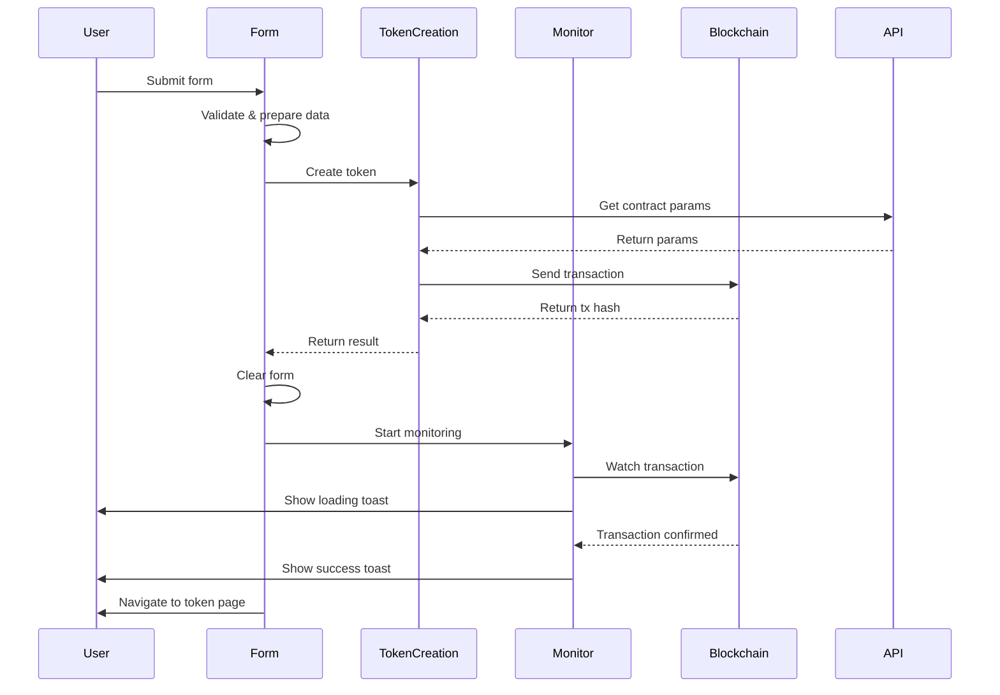

# Token Creation Architecture

## Overview

Clean separation of concerns architecture for token creation workflow.

## Architecture Layers

```
┌─────────────────────────────────────────────────────────┐
│                   TokenCreationForm                      │
│         (UI Component - User Interaction)                │
└────────────┬────────────────────────────────────────────┘
             │
             ▼
┌─────────────────────────────────────────────────────────┐
│                    useTokenForm                          │
│     (Form State Management - Validation Only)            │
└────────────┬────────────────────────────────────────────┘
             │
             ▼
┌─────────────────────────────────────────────────────────┐
│                  useTokenCreation                        │
│        (Business Logic - API + Contract)                 │
└────────────┬────────────────────────────────────────────┘
             │
             ▼
┌─────────────────────────────────────────────────────────┐
│               useTransactionMonitor                      │
│     (Infrastructure - Blockchain Monitoring)             │
└─────────────────────────────────────────────────────────┘
```

## Component Responsibilities

### 1. TokenCreationForm Component

**Location**: `/src/components/create-token/TokenCreationForm.tsx`
**Responsibilities**:

- Orchestrates the entire flow
- Manages UI state (isProcessing)
- Coordinates between hooks
- Handles navigation after success

### 2. useTokenForm Hook

**Location**: `/src/components/create-token/hooks/useTokenForm.ts`
**Responsibilities**:

- Form state management
- Input validation
- File uploads
- Data preparation
- NO business logic
- NO contract interaction
- NO monitoring

### 3. useTokenCreation Hook

**Location**: `/src/hooks/useTokenCreation.ts`
**Responsibilities**:

- API call to get contract parameters
- Contract transaction execution
- Returns transaction hash
- NO form logic
- NO monitoring
- NO UI updates

### 4. useTransactionMonitor Hook

**Location**: `/src/hooks/useTransactionMonitor.ts`
**Responsibilities**:

- Monitor any blockchain transaction
- Show toast notifications
- Provide blockchain explorer links
- Completely reusable
- NO business logic

## Flow Diagram



## Benefits

### 1. Separation of Concerns

- Each layer has a single responsibility
- Easy to understand and maintain
- Clear boundaries between layers

### 2. Testability

- Form logic can be tested without blockchain
- Business logic can be tested without UI
- Monitor can be tested independently

### 3. Reusability

- `useTransactionMonitor` can monitor any transaction
- `useTokenCreation` can be used anywhere
- Form logic is isolated and reusable

### 4. Maintainability

- Changes to one layer don't affect others
- Easy to add new features
- Clear debugging path

## Usage Example

```tsx
// In any component
const { createToken } = useTokenCreation()
const monitor = useTransactionMonitor({
  onSuccess: () => console.log('Success!'),
  onError: () => console.log('Failed!'),
})

// Create token
const result = await createToken(data)
if (result) {
  // Monitor transaction
  monitor.startMonitoring(result.transactionHash)
}
```

## Key Improvements

1. **280+ lines reduced to 4 focused hooks**
2. **Single responsibility principle enforced**
3. **Completely decoupled layers**
4. **Reusable transaction monitoring**
5. **Clean error handling**
6. **Better TypeScript types**
