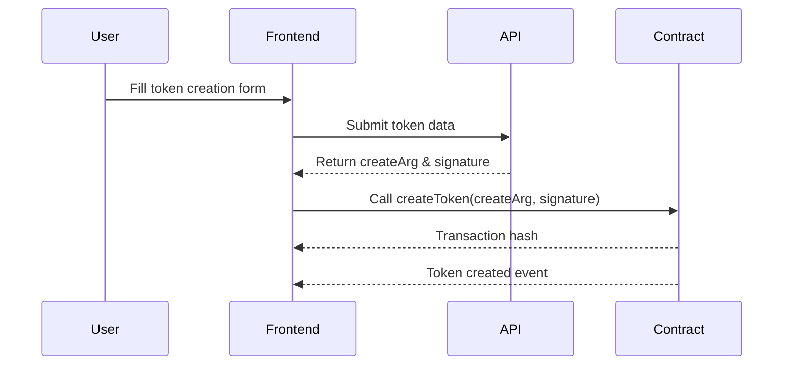

# CoinRollCore Smart Contract Integration

## Overview

This document describes the integration of the CoinRollCore smart contract with the token creation flow in the Coinroll Web v2 application.

## Architecture

The integration follows a two-step process:

1. **API Call**: Submit token creation parameters to the backend API
2. **Contract Call**: Use the returned `createArg` and `signature` to call the smart contract

## Implementation Details

### 1. API Response Structure

The backend API returns the following structure after processing token creation:

```typescript
{
  "code": 200,
  "message": "success",
  "data": {
    "create2Salt": "0x...",         // Salt for CREATE2 deployment
    "createArg": "0x...",           // Encoded arguments for contract
    "nonce": 64096,
    "predictedAddress": "0x...",    // Predicted token address
    "requestId": "0x...",           // Unique request ID
    "signature": "0x...",           // Signature for contract call
    "timestamp": 1754306721
  }
}
```

### 2. Contract Method

The smart contract's `createToken` method accepts two parameters:

- `data` (bytes): The `createArg` from API response
- `signature` (bytes): The `signature` from API response

### 3. Integration Flow



## Configuration

### Environment Variables

Add the following environment variables to your `.env.local` file:

```bash
# BSC Mainnet Contract Addresses
NEXT_PUBLIC_COINROLL_CORE_ADDRESS_MAINNET=0x... # Replace with actual address

# BSC Testnet Contract Addresses
NEXT_PUBLIC_COINROLL_CORE_ADDRESS_TESTNET=0x... # Replace with actual address
```

### Chain Selection

The contract address is automatically selected based on the `NEXT_PUBLIC_CHAIN_ENV` environment variable:

- `mainnet`: Uses BSC mainnet addresses
- `testnet`: Uses BSC testnet addresses

## Key Files Modified

### 1. API Schema Updates

- **File**: `src/api/schemas/token.schema.ts`
- **Changes**: Updated `CreateTokenResponseSchema` to include contract parameters

### 2. Contract Integration

- **Files Added**:
  - `src/contracts/types/coinrollCore.ts` - Type definitions
  - `src/contracts/addresses/index.ts` - Contract address management
  - `src/contracts/hooks/coinrollCore/useCreateTokenContract.ts` - Contract interaction hook
  - `src/contracts/utils/validation.ts` - Input validation
  - `src/contracts/utils/errors.ts` - Error handling

### 3. Form Integration

- **File**: `src/components/create-token/hooks/useTokenForm.ts`
- **Changes**: Integrated contract call after API response

## Usage

### 1. Token Creation Flow

```typescript
// 1. User fills the form and submits
const result = await createTokenMutation.mutateAsync(formData)

// 2. Extract contract parameters from API response
const { createArg, signature, predictedAddress } = result.data

// 3. Call the smart contract
const contractResult = await createTokenContract.createToken({
  createArg: createArg as Hex,
  signature: signature as Hex,
  value: BigInt(0), // Add value if initial buy is configured
})

// 4. Handle success - redirect to token page
if (predictedAddress) {
  router.push(`/token/${predictedAddress}`)
}
```

### 2. Error Handling

The integration includes comprehensive error handling:

- API errors are caught and displayed to users
- Contract errors are parsed and show user-friendly messages
- Gas estimation failures are handled gracefully
- Transaction rejection by users is handled

## Testing

### Local Testing

1. Set up your environment variables:

   ```bash
   NEXT_PUBLIC_CHAIN_ENV=testnet
   NEXT_PUBLIC_COINROLL_CORE_ADDRESS_TESTNET=0x... # Your test contract
   ```

2. Connect to BSC Testnet in your wallet

3. Ensure you have test BNB for gas fees

4. Create a token through the UI

### Contract Verification

After deploying the CoinRollCore contract:

1. Verify the contract on BSCScan
2. Update the contract address in environment variables
3. Test the full flow from UI to blockchain

## Security Considerations

1. **Signature Validation**: The contract validates signatures server-side
2. **Input Validation**: All inputs are validated before contract calls
3. **Gas Estimation**: Gas is estimated before executing transactions
4. **Error Recovery**: Failed transactions can be retried
5. **Address Verification**: Contract addresses are validated before use

## Troubleshooting

### Common Issues

1. **"Contract address not configured"**
   - Solution: Set the appropriate environment variable for your network

2. **"Gas estimation failed"**
   - Check wallet has sufficient BNB
   - Verify contract is deployed and accessible
   - Check input parameters are valid

3. **"Invalid signature"**
   - Ensure API is returning correct signature
   - Verify contract expects the same encoding format

## Future Enhancements

1. **Initial Buy Support**: Add BNB value for initial token purchase
2. **Event Monitoring**: Watch for token creation events
3. **Transaction Status**: Real-time transaction status updates
4. **Multi-chain Support**: Extend beyond BSC
5. **Batch Creation**: Support creating multiple tokens

## References

- [Wagmi Documentation](https://wagmi.sh)
- [Viem Documentation](https://viem.sh)
- [BSC Documentation](https://docs.bnbchain.org)
